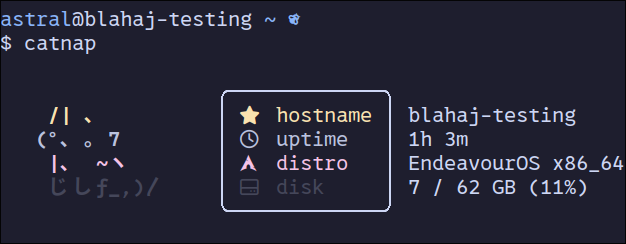

# kittynap  
kittynap is a fork of [catnap](https://github.com/iinsertnamehere/catnap), but instead of using distro ascii art, it uses ascii art of a cat.  
  
## installing  
  
you will need the packages nim, gzip, pcre, and usbutils.  
<details>  
  <summary>arch linux</summary>  
  
  ```bash
  sudo pacman -S nim gzip pcre usbutils --needed
  ```
  
</details>  
  
now, clone this repository  
```bash
git clone https://github.com/blahaj-rip/kittynap --depth 1 
```

and change directory into kittynap  
```bash
cd ./kittynap
```
  
finally, install using **nim**  
```bash
nim install
```
  
now, you can run kittynap!  
```bash
catnap
```
> [!NOTE]
> even though the project name is different, the command stays `catnap`.

## demo  
  
  
## customisation  
by default, the colours will be those of the nonbinary pride flag. sometimes, these colours can be hard to read, or you just simply may not like them.  
you can change this by modifying the colours in ~/.config/distros.toml and config.toml  
  
### colour options  
foreground (normal) -> `(#)`, foreground (bright) -> `{#}`  
background normal -> `[#]`, background bright -> `<#>`  
  
### colours
black -> `BK`  
red -> `RD`  
green -> `GN`  
yellow -> `YW`  
blue -> `BE`  
magenta -> `MA`  
cyan -> `CN`  
white -> `WE`    
  
### example
so, using the above colour codes, we can get this:  
```
"{YW} /| ､      ",
"{WE}(°､ ｡ 7    ",
"{MA} |､  ~ヽ   ",
"{BK} じしf_,)〳",
```

## credits  
catnap -- [iinsertnamehere](https://github.com/iinsertnamehere)  
cat ascii art -- [pfetch with kitties](https://github.com/GuardKenzie/pfetch-with-kitties) by [guardkenzie](https://github.com/GuardKenzie)  
  
## license  
catnap -- and as an extension, kittynap -- is licensed under the [mit license](LICENSE)  